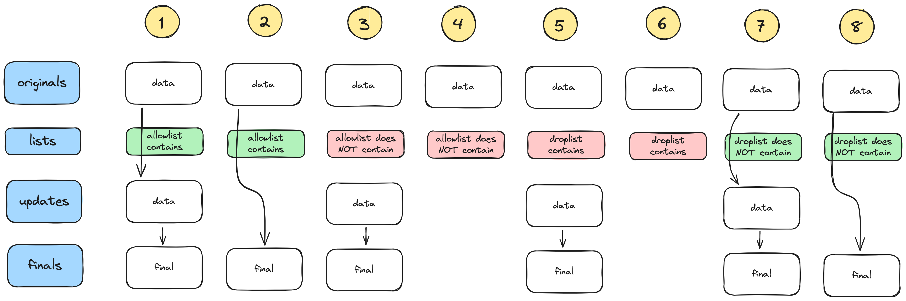

# extending-testing-ph2-03-challenge

Some test with original data

Some test without original data

We are starting test planning with some distinct main considerations:
1. How valid data that 'works' within the program is handled in terms of how it is 'allowed' or 'dropped' and what is passed into `finals`.
2. How different data is processed and if it works as expected.
3. How the program behaves with more than one name file.
4. How the program deals with multiple entries with the same surname referring to different people.

Early manual exploration has shown no obvious problems and the supplied test data appears to work properly in the app making it ideal data to use for initial testing of the basic expected 'routes' that data is expected to take and what should be expected to end up in `finals`.

## Test cases

### Basic functionality using provided data set

A set of tests using the provided data set for each combination of originals present/absent, updates present/absent, allowlist/droplist containing/not containing. This constitutes the 12 tests in the diagrams above.

### Different name and address data

To test things such as addresses of different lengths, different postcade formats, name formats, etc.

### More than one file being processed at a time with different outcomes.

Testing multiple names and situations all at once rather than the individual focussed tests to reproduce a more 'real world' scenario for testing.

### Mulitple entries with the same surname

This includes have multiple people with the same surname alongside each other in the same directory, e.g. originals, but also the possibility of having people with the same surname each in the different source directories.

