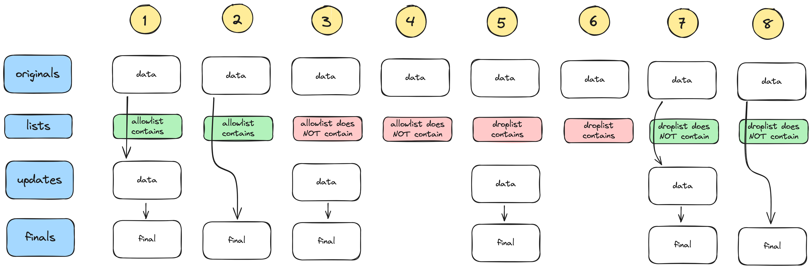
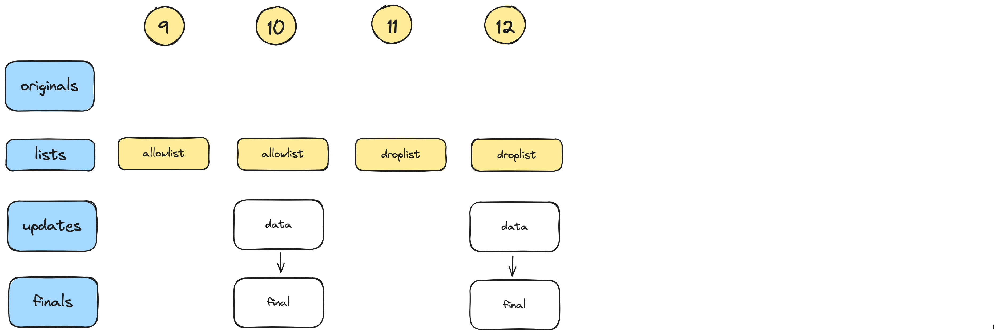

Some test with original data

Some test without original data

| Test  | Expected  | Actual | As expected |
| ----------------------- | ----------------- | ----------------- | ------|
| 1 | Updated => Finals | Updated => Finals | Y |
| 2 | Originals => Finals | Originals => Finals | Y |
| 3 | Updated => Finals | Updated => Finals | Y |
| 4 | No Finals |  No finals | Y |
| 5 | Updated => Finals | Updated => Finals | Y |
| 6 | No Finals |  No finals | Y |
| 7 | Updated => Finals | Updated => Finals | Y |
| 8 | Originals => Finals | Originals => Finals | Y |
| 9 | No Finals |  No finals | Y |
| 10 | Updated => Finals | Updated => Finals | Y |
| 11 | No Finals |  No finals | Y |
| 12 | Updated => Finals | Updated => Finals | Y |
